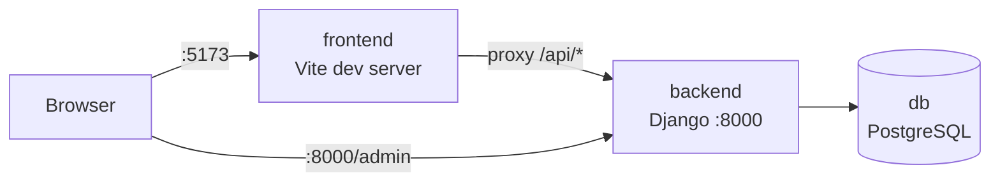
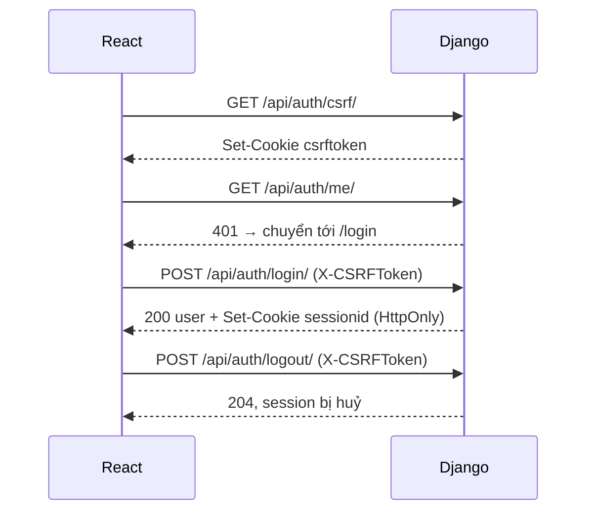
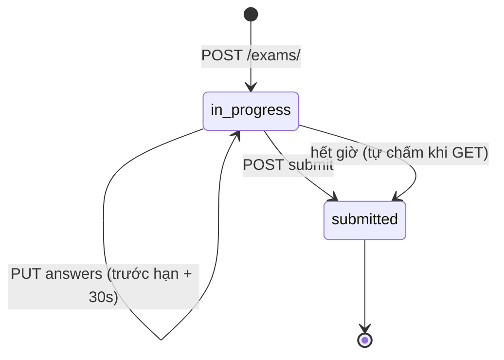

# driving-theory

- **Backend**: Django 5.2 LTS + Django REST Framework + PostgreSQL 17 (`backend/`)
- **Frontend**: React 19 + Vite + TypeScript (`frontend/`)
- Chạy toàn bộ bằng Docker Compose (dev mode, hot-reload cả BE và FE)



## Bắt đầu

```bash
cp .env.example .env
# Sửa DJANGO_SECRET_KEY và POSTGRES_PASSWORD trong .env
docker compose up --build
```

- Frontend: http://localhost:5173
- API health: http://localhost:8000/api/health/
- Django admin: http://localhost:8000/admin/

Migration tự chạy khi backend khởi động (`backend/entrypoint.sh`). Lần đầu chạy, nạp dữ liệu câu hỏi:

```bash
docker compose exec backend python manage.py import_questions
```

## Đăng nhập / Đăng xuất

Dùng **Django session + CSRF** (cookie `sessionid` là HttpOnly, JS không đọc được). Chưa có chức năng đăng ký, tạo user bằng:

```bash
docker compose exec backend python manage.py createsuperuser
```

| Endpoint | Method | Mô tả |
|---|---|---|
| `/api/auth/csrf/` | GET | Set cookie `csrftoken` |
| `/api/auth/login/` | POST | `{username, password}` → user. Giới hạn `LOGIN_THROTTLE_RATE` |
| `/api/auth/logout/` | POST | Huỷ session |
| `/api/auth/me/` | GET | User hiện tại, `401` nếu chưa đăng nhập |



Mọi request không an toàn (POST/PUT/PATCH/DELETE) đều phải gửi header `X-CSRFToken`; `src/api/client.ts` tự gắn header này. Gặp `401` ở bất kỳ API nào → FE tự chuyển về trang đăng nhập.

## Dữ liệu 600 câu hỏi

Dữ liệu nằm ở `backend/data/gplx600/` (nguồn gốc xem `SOURCE.md`):

- `questions.json` + `images/`: dữ liệu câu hỏi (đã sửa lỗi trích xuất ở câu 301, 302, 352, 362)

```bash
docker compose exec backend python manage.py import_questions   # chạy lại an toàn (idempotent)
```

Lệnh import validate toàn bộ dữ liệu trước (mỗi câu đúng 1 đáp án, ảnh tồn tại...), lỗi thì không ghi gì vào DB. Ảnh được copy vào `MEDIA_ROOT/questions/`.

| Endpoint | Mô tả |
|---|---|
| `GET /api/chapters/` | 6 chương + số câu |
| `GET /api/questions/?chapter=&critical=&license_class=&page=&page_size=` | Danh sách câu hỏi (phân trang, tối đa 100/trang); `license_class=A1` chỉ lấy 250 câu của hạng A1 |
| `GET /api/questions/<number>/` | Chi tiết 1 câu |

Các API này yêu cầu đăng nhập. Quản lý câu hỏi tại `/admin/`.

## Thi thử

Giao diện (http://localhost:5173): chọn hạng → làm bài → xem kết quả, xem lại từng câu → lịch sử thi.

- Đồng hồ chạy theo giờ server (`remaining_seconds`), mô phỏng đèn đếm giây ở ngã tư: xanh → vàng (còn 2 phút) → đỏ (còn 30 giây); hết giờ tự nộp bài.
- Mỗi lần chọn đáp án được lưu ngay; tải lại trang hoặc mất mạng không mất bài (khi nộp, toàn bộ đáp án được gửi lại).
- Phím tắt: `1`–`4` chọn đáp án, `←` `→` chuyển câu.
- Code FE: `src/exam/` (ExamRunner, ExamResult, Countdown), `src/pages/` (HomePage, ExamPage, HistoryPage).

Luật thi theo **Thông tư 12/2025/TT-BCA** (số câu, thời gian, điểm đạt) và **Công văn 2262/CSGT-P5** (cấu trúc đề, bộ câu A1/A, B1), cấu hình tại `backend/apps/exams/rules.py`.

| Hạng | Câu | Phút | Đạt | Bộ câu hỏi |
|---|---|---|---|---|
| A1 / A | 25 | 19 | 21 / 23 | 250 câu |
| B1 | 25 | 19 | 23 | 300 câu |
| B | 30 | 20 | 27 | 600 câu |
| C1 | 35 | 22 | 32 | 600 câu |
| C | 40 | 24 | 36 | 600 câu |
| D1, D2, D, BE, C1E, CE, D1E, D2E, DE | 45 | 26 | 41 | 600 câu |

Mỗi đề có đúng 1 câu điểm liệt; sai câu này là trượt dù đủ điểm.

| Endpoint | Mô tả |
|---|---|
| `GET /api/exams/rules/` | Luật thi các hạng |
| `POST /api/exams/` `{license_class}` | Tạo đề ngẫu nhiên (giới hạn `EXAM_CREATE_THROTTLE_RATE`) |
| `GET /api/exams/` | Lịch sử thi |
| `GET /api/exams/<id>/` | Đề thi; **đáp án chỉ trả về sau khi nộp** |
| `PUT /api/exams/<id>/answers/` `{question, position}` | Lưu từng đáp án (autosave) |
| `POST /api/exams/<id>/submit/` `{answers?}` | Nộp bài, chấm điểm |



Chấm điểm ở server. Hết giờ: câu đã lưu được chấm, câu chưa trả lời tính sai (như phần mềm sát hạch thật).

> ⚠️ Dự thảo thông tư thay thế Thông tư 12/2025 dự kiến áp dụng luật mới từ 01/3/2027 (tăng số câu, bỏ câu điểm liệt). Khi ban hành chính thức cần cập nhật `rules.py`.

## Lệnh thường dùng

```bash
docker compose exec backend python manage.py createsuperuser
docker compose exec backend python manage.py startapp <name> apps/<name>   # tạo thư mục apps/<name> trước
docker compose exec backend python manage.py makemigrations
docker compose exec backend python manage.py test
docker compose exec frontend npm install <package>
docker compose down        # dừng
docker compose down -v     # dừng + xoá dữ liệu DB
```

## Cấu trúc

```
backend/
  config/         # settings, urls, wsgi/asgi
  apps/core/      # health-check endpoint
  apps/accounts/  # login / logout / me API
  apps/questions/ # model + API + lệnh import bộ 600 câu
  apps/exams/     # luật thi theo hạng, tạo đề, chấm điểm
  data/gplx600/   # dữ liệu nguồn
frontend/
  src/api/        # API client (gọi /api, được Vite proxy sang backend, tự gắn CSRF)
  src/auth/       # AuthProvider, useAuth, RequireAuth (route guard)
  src/pages/      # LoginPage, HomePage
docker-compose.yml
.env.example
```
